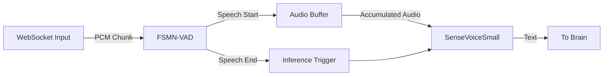

# ASR 模块详细设计方案

## 1. 概述

本模块负责 AI 伴侣的“听觉”功能，即将用户的实时语音流转换为文本。
考虑到 AI 伴侣的交互特性（需要理解完整意图后回复），本设计采用 **"流式 VAD (语音活动检测) + 快速离线推理"** 的混合架构。

*   **核心模型**: `SenseVoiceSmall` (多语言、情感识别、极速)
*   **VAD 模型**: `FSMN-VAD` (高精度、低延迟流式检测)
*   **输入**: WebSocket 传输的 PCM 音频流
*   **输出**: 完整的用户语音文本 (Async Generator)

---

## 2. 架构设计

### 2.1 为什么不完全使用流式 ASR (Streaming ASR)?

虽然 FunASR 提供了 Paraformer-Streaming，但在 AI 伴侣场景下，完全流式有以下劣势：
1.  **RAG/LLM 触发时机**: RAG 和 LLM 需要完整的句子上下文。如果 ASR 实时吐字（如 "今...今天...今天天...今天天气"），很难判断何时将其送入 LLM。
2.  **准确率**: 非流式模型（如 SenseVoice）通常比流式模型准确率更高，且支持情感识别。
3.  **计算效率**: SenseVoice 推理极快，"积攒一段音频一次性推理" 比 "每毫秒都在推理" 更节省算力，且对 GPU 显存带宽更友好。

### 2.2 混合流水线 (Pipeline)



1.  **监听阶段**: 持续接收音频包，送入 VAD 检测。
2.  **缓冲阶段**: 当 VAD 判定"正在说话"，将音频存入 Buffer。
3.  **触发阶段**: 当 VAD 判定"说话结束"（尾部静音 > 阈值），提交 Buffer 进行推理。
4.  **推理阶段**: SenseVoiceSmall 在独立线程中处理音频，输出文本。
5.  **重置**: 清空 Buffer，准备下一轮对话。

---

## 3. 核心类设计

### 3.1 `FunASRService` (server/core/asr.py)

该类实现 `ASRInterface`，是外部调用的唯一入口。

#### 属性
*   `model`: SenseVoiceSmall 模型实例。
*   `vad_model`: FSMN-VAD 模型实例。
*   `executor`: `ThreadPoolExecutor`，用于在 asyncio 中运行 GPU 密集型任务。

#### 关键方法

1.  `__init__()`: 
    *   加载模型权重（需处理 GPU/CPU 设备映射）。
    *   初始化线程池。

2.  `transcribe_stream(audio_generator)`:
    *   **输入**: `AsyncGenerator[bytes]` (来自 WebSocket)
    *   **输出**: `AsyncGenerator[str]` (完整的句子)
    *   **逻辑**:
        *   维护一个内部 `buffer` (bytearray)。
        *   维护 VAD 状态 (SILENCE, SPEAKING)。
        *   循环读取 `chunk`，送入 `vad_model`。
        *   若检测到 End of Speech (EOS):
            *   调用 `_run_inference(buffer)`。
            *   Yield 识别出的文本。
            *   清空 buffer。

3.  `_run_inference(audio_bytes)`:
    *   私有方法，封装 `model.generate()`。
    *   使用 `loop.run_in_executor` 避免阻塞主事件循环。
    *   处理音频格式转换 (Bytes -> Numpy/Torch Tensor)。

### 3.2 VAD 状态管理逻辑

为了防止 VAD 过于敏感（噪音触发）或切断过快（句间停顿），需要简单的状态机：

*   **参数**:
    *   `max_single_segment_time`: 60s (最长录音限制，强制截断)
    *   `vad_silence_duration`: 800ms (尾部静音阈值，超过即认为说完)
    *   `vad_speech_noise_thres`: 0.6 (概率阈值)

---

## 4. 关键实现细节

### 4.1 异步与阻塞的共存

FastAPI 是异步的，但 PyTorch 推理是同步阻塞的。绝不能在 `async def` 中直接运行 `model.generate()`，否则会卡死整个 WebSocket 服务（导致其他人连不上，或音频丢包）。

**解决方案**:
```python
import asyncio
from concurrent.futures import ThreadPoolExecutor

class FunASRService:
    def __init__(self):
        self.executor = ThreadPoolExecutor(max_workers=1) # 串行推理避免显存竞争

    async def _run_inference(self, audio_data):
        # 将同步任务扔到线程池
        loop = asyncio.get_running_loop()
        text = await loop.run_in_executor(
            self.executor, 
            self._inference_sync, 
            audio_data
        )
        return text

    def _inference_sync(self, audio_data):
        # 实际的 GPU 推理代码
        res = self.model.generate([audio_data], ...)
        return res[0]['text']
```

### 4.2 音频格式处理

*   **输入**: WebSocket 通常传输 PCM 原始字节流。
    *   Format: 16000Hz, 1 channel, 16-bit PCM (int16).
*   **VAD/Model 输入**: 通常需要 float32 或 int16 的 numpy array。
*   **转换**:
    ```python
    import numpy as np
    # bytes -> int16 -> float32 (if needed)
    audio_int16 = np.frombuffer(chunk, dtype=np.int16)
    ```

### 4.3 显存管理

SenseVoiceSmall 极小 (<1GB VRAM)，FSMN-VAD 也极小。
但需注意与 LLM (14B, ~10GB VRAM) 共存。
*   **初始化**: 在 `startup_event` 中预加载，避免请求时加载的延迟。
*   **设备**: 默认 `cuda:0`。

---

## 5. 接口定义

### server/core/asr.py (Proposed)

```python
class FunASRService(ASRInterface):
    def __init__(self):
        # 加载配置
        # self.vad = FsmnVadOnline(...)
        # self.sense_voice = SenseVoiceSmall(...)
        pass

    async def transcribe_stream(self, audio_stream: AsyncGenerator[bytes, None]) -> AsyncGenerator[str, None]:
        """
        处理音频流，返回识别到的完整句子。
        """
        # VAD 缓存
        cache = {} 
        buffer = bytearray()
        
        async for chunk in audio_stream:
            # 1. 累积 Buffer (用于最后的推理)
            buffer.extend(chunk)
            
            # 2. VAD 判决 (伪代码)
            # vad_result = self.vad.step(chunk, cache)
            
            # 3. 状态分支
            # if vad_result == 'speech_end':
            #     text = await self._run_inference(buffer)
            #     if text: yield text
            #     buffer.clear()
            #     reset_vad_cache()
            
            pass
```

---

## 6. 配置参数 (Config Requirements)

需在 `server/core/config.py` 中添加或确认以下参数：

```python
class Settings(BaseSettings):
    # ... existing ...
    
    # ASR Specific
    ASR_MODEL_DIR: str = "iic/SenseVoiceSmall"
    VAD_MODEL_DIR: str = "iic/speech_fsmn_vad_jc_84000-20k-pytorch"
    
    # Audio Specs
    SAMPLE_RATE: int = 16000
    CHANNELS: int = 1
    
    # VAD Parameters
    VAD_SILENCE_THRESHOLD: int = 800  # ms
```

## 7. 部署注意事项

1.  **依赖安装**:
    需确保 `funasr` 和 `modelscope` 已正确安装，且能访问 HuggingFace/ModelScope 下载模型。
2.  **音频前端**:
    前端(Client)必须保证发送的是 **16k 16bit 单声道 PCM**。如果前端发送 Opus/MP3，后端需增加解码层 (ffmpeg)。为降低延迟，建议前端直接采 PCM 发送。

---
**Status**: Draft
**Last Updated**: 2025-02-01
